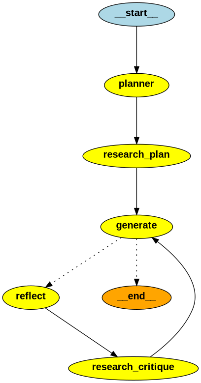

# Iterative Multi-Agent Essay Writer

This project demonstrates a sophisticated **AI Orchestration** pattern using **LangGraph** and **LangChain**. It moves beyond simple prompt-response loops by implementing a structured "Plan-Research-Generate-Reflect" pipeline.



## Project Goal
The goal is to produce a well-researched, high-quality 5-paragraph essay through iterative refinement. An "Assistant" writes the draft, a "Researcher" gathers evidence, and a "Teacher" provides critical feedback to trigger revisions.

##  Architecture & Logic

The system utilizes a **StateGraph** to manage the flow of data across specialized nodes:

| Node | Responsibility |
| :--- | :--- |
| **Planner** | Creates a high-level outline based on the user's topic. |
| **Research Plan** | Generates 3 targeted search queries and scrapes data via Tavily API. |
| **Generator** | Synthesizes the plan and research data into a cohesive essay draft. |
| **Reflector** | Analyzes the draft for depth, style, and accuracy (The "Teacher"). |
| **Research Critique** | Conducts additional research specifically to address the Teacher's gaps. |

### The Iteration Loop
The agent does not stop after the first draft. It enters a **Conditional Loop**:
1. It compares the `revision_number` against `max_revisions`.
2. If more work is needed, it routes to the **Reflector** and **Research Critique** nodes.
3. If the limit is reached, it routes to `END`.

---

##  Tech Stack

* **Orchestration:** [LangGraph](https://github.com/langchain-ai/langgraph)
* **LLM Interface:** [LangChain OpenAI](https://github.com/langchain-ai/langchain-extract) (via **OpenRouter**)
* **Search Engine:** [Tavily AI](https://tavily.com/)
* **Data Validation:** [Pydantic v2](https://docs.pydantic.dev/)
* **Models Used:** `google/gemini-2.0-flash-001` (or any OpenAI-compatible model)

---

##  Getting Started

### 1. Installation
```bash
pip install -U langchain langgraph langchain-openai tavily-python pydantic
```
### 2. Environment Setup
You must provide your API keys. If you are using GitHub Codespaces, add these to your **Secrets**; otherwise, set them in your terminal or a `.env` file:

* `OPENROUTER_API_KEY`: Required for LLM inference via OpenRouter.
* `TAVILY_API_KEY`: Required for the research/search nodes.

### 3. Running the Workflow
To execute the agent, initialize the graph with a checkpointer and provide a `thread_id` to maintain state.

```python
# Configure the thread for persistence
thread = {"configurable": {"thread_id": "research_session_001"}}

# Define the initial state
inputs = {
    'task': "The role of Transformers in scRNA-seq classification",
    "max_revisions": 2,
    "revision_number": 0,
}

# Execute the graph
for event in graph.stream(inputs, thread):
    print(event)


##  Key Technical Concepts

### Structured State
Unlike a basic chat history, we use a `TypedDict` to store specific artifacts like `plan`, `draft`, and `critique`. This ensures nodes only process the data they need, reducing prompt token waste and keeping the context window focused on the current task.


### Structured Output
We use `model.with_structured_output(Queries)` to force the LLM to return a Python object rather than a string. This allows our research nodes to iterate through search queries programmatically, ensuring the data flow between the LLM and our Python functions is type-safe and reliable.

### Checkpointing & Persistence
The use of `MemorySaver()` (or `SqliteSaver`) allows the graph to persist its state. This enables:

* **Fault Tolerance:** Resume a long-running research task if the connection drops or a node fails.
* **Human-in-the-Loop:** Pause the execution for manual approval or editing of a draft before the next revision cycle begins.
* **Time Travel:** Inspect or "rewind" to previous versions of the essay state for debugging.


---

## Future Improvements

* **Academic Formatting:** Add a dedicated node to format citations in APA/IEEE style using specific bibliography tools.
* **Multi-Model Routing:** Implement a strategy to use a faster, cheaper model (like Gemini 2.0 Flash) for research tasks and a more powerful model (like Claude 3.5 Sonnet) for the final creative generation.
* **Custom Tools:** Integrate specialized bioinformatics packages (such as `scTRaCT`) as nodes or tools for domain-specific data validation in technical essays.